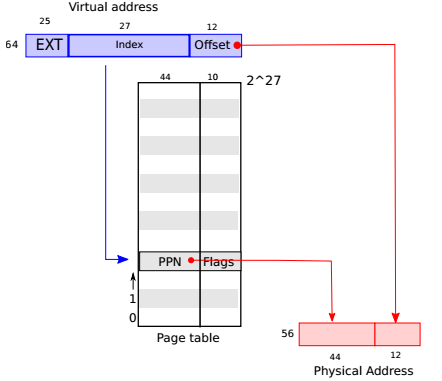
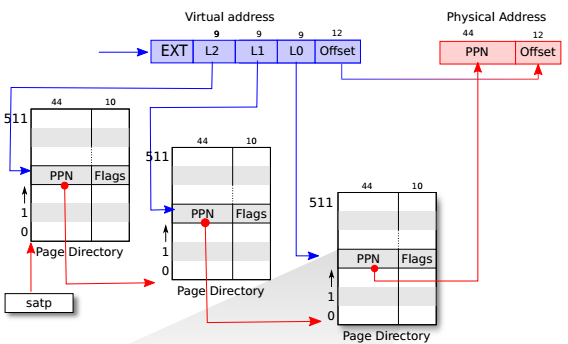
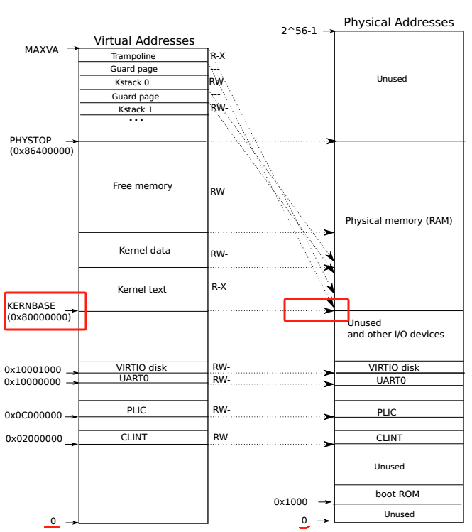
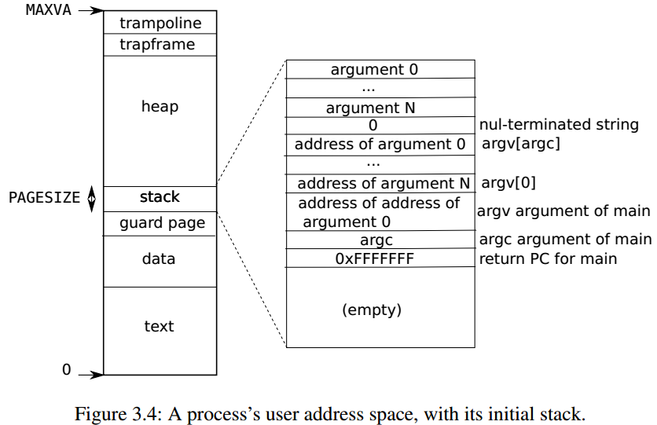
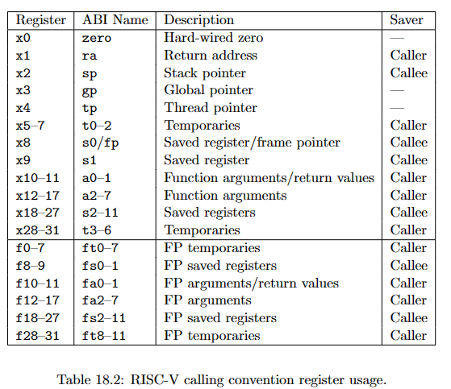
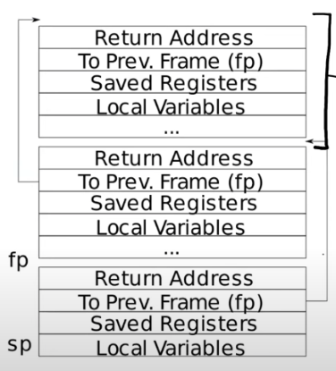

# xv6

`fork()`父进程创建子进程时，子进程**复制**父进程的内存空间、堆栈、代码、数据等，在另一块内存区域保存。**两者并不共享内存区域**  

- 当我们采用fork时，子进程并不会一开始就复制父进程的内存。相反会共享内存空间，当一个进程尝试修改共享的内存时，操作系统才会真正复制。-->虚拟内存技术 (copy-on-write)

`wait()`用来等待子进程结束，获得子进程退出状态返回给父进程。若没有子进程退出**wait会一直等待，知道有一个退出为止**。如果父进程不关注子进程退出状态就采用`wait(0)`  

`exec()`将内存中原有代码数据被新程序取代-->意味着exec允许一个进程在运行时切换到不同的程序

`close()`关闭进程中某个文件描述符，让其可以复用 

`dup()`创建一个现有文件描述符的副本，允许多个文件描述符引用相同的文件或资源，**关闭其中一个并不会影响另一个** ，共享文件偏移量

- `dup()`会自动将副本赋值给当前进程的**最小未使用**文件描述符

**文件描述符表中每一个条目都包含了文件指针、文件状态、偏移量、引用计数等。而文件描述符只是其索引**

- 0-->标准输入
- 1-->标准输出
- 2-->标准error

**pipe实质上是小的内存缓冲区**，暴露给进程两个文件描述符，一个往进写，一个往出读

- fd[0]-->从管道读
- fd[1]-->往管道写


```cpp
int p[2];
char *argv[2];
argv[0] = "wc";
argv[1] = 0;
pipe(p);
if(fork() == 0) {
	close(0);
	dup(p[0]);
	close(p[0]);
	close(p[1]);
	exec("/bin/wc", argv);
} else {
	close(p[0]);
	write(p[1], "hello world\n", 12);
	close(p[1]);
}
```

其中close(p[0]),close(p[1])是因为p[0]已经被复制到 0 文件描述符了 然后关闭子进程中管道的读端写端 这样子进程就可以写入管道

`Mknod()` 创建的是一个设备文件

当进程打开一个设备文件时，内核会将 read write 转移到内核实现

`link()` 系统调用创建另一个文件的名称 两者共享一个inode 实现如下：

> ```c++
> open("a",O_CREATW|O_WRONLY);
> link("a","b");
> ```


**`cd` 命令并不像其他命令一样创建一个子进程 **

***

## Lecture 1:

文件描述符为每个正在运行的程序提供内核中索引

当使用 fork 创建一个进程时 在父进程中返回子进程的pid 在子进程中返回 0 代表子进程正在运行

平常在shell中输入命令 其实就是shell进程创建了一个子进程 来执行命令程序

fork 和 exec通常结合使用 是因为需要父进程和子进程执行不同程序 exec可以将复制过来的父进程代码转换成自己需要运行的

***

## Lab 1：

pipe是半双工的，所以当父子进程要进行相互通信时，必须要使用两个。使用一个会造成竞态条件，例如两个进程同时往里写同时往外读。

> 管道没有锁机制，因此如果在这种情况下使用管道，需要自行设计管道管理

关于**primes lab**：

1. 在使用pipe时，记住pipe是个缓冲区，可以通过循环一个个写入。并不用直接全部输入进去。等到传输的东西都输入进pipe后，再fork用子进程去读取。写完记得关闭写的文件描述符。
2. exit(0)与wait(0)前者是终止当前进程，后者是让父进程等待一个子进程的结束。父进程会阻塞在这里，直到有一个子进程结束。
3. 若当前进程没有创建子进程，当使用wait()时，就会立刻返回，不起任何作用

关于**find lab**:

1. stat()是一个路径指定的文件信息，fstat()则是通过一个文件描述符来查看文件信息
2. 养成用完文件描述符就关闭的习惯
3. memmove()内存复制的标准库函数`memmove(p, de.name, DIRSIZ)`将de.name所指复制到p所指空间中，复制DIRSIZ大小

关于**xargs lab**:

1. `echo hello too | xargs echo bye`在这句命令中，xargs接收到的argc=3 分别是 xargs名本身 以及 echo 和 bye。所以有了下面这段代码:
```c++ 
for(int i=1;i<argc;i++){
     args[i-1]=argv[i];
    }.....
 ..... 
	args[argc-1]=buf;//让传过来的参数附加到参数列表里
        if(exec(argv[1],args)<0){//argv[0]是xargs本身 
           fprintf(2,"exec: error\n");
    }
```

2. xargs是从**standard input**中读取数据 也就是标准输入 而不是standard output!

***

操作系统必须满足三个要求：**multiplexing(多路复用)，isolation(隔离),interaction(交互)**

系统调用system call就是抽象了计算机资源的接口，实现了应用程序和硬件的隔离

为了实现application之间的隔离，即一个崩溃了不影响其他运行，cpu提供了硬件支持。RISC-V有三种cpu执行的模式：**machine mode,supervisor mode, user mode**. application想要调用内核函数通过系统调用,就必须切换到内核。这时cpu会通过一个指令从user mode 转换到 supervisor mode(在RISC-V中是ecall)，**并在内核指定入口点进入内核**，切换mode后，内核决定是否进行执行application的执行请求。

> 系统调用和内核函数的区别：系统调用是application访问内核功能的接口，而内核函数是在操作系统内核汇总的函数，执行内核功能例如进程管理、内存管理等。**内核函数通常是内核内部使用的函数，而系统调用是用户空间应用程序使用的接口**

**Monolithic Kernel** 单体内核，即整个操作系统都在内核中，所有的系统调用都以supervisor mode 执行。（windows ，linux,macOS都是这种设计）

> 在单体内核模式下，若某一个系统调用出错，因为此时cpu是supervisor mode 拥有绝对的所有权，因此可能会导致整个内核崩溃。为了减少这种风险，人们减少了在supervisor mode下运行的代码量，将大部分代码在user mode下运行

以上想法就是**Microkernel**，将核心功能分成小模块，通过消息传递等机制进行模块间通信

每一个进程都有一个执行线程，专门用来执行指令。执行线程挂起时，相关状态保存在线程自己的栈中。

每一个进程都有两个栈，一个 user stack 一个kernel stack。当执行用户指令时，使用user stack，反之，进程进入内核时，代码就会在kernel stack上执行。

**xv6的启动和第一个进程执行过程：**

1. 当RISC-V计算机通电时，先初始化自己，然后运行在read-only memory里的加载程序。加载程序将xv6的内核加载到内存，在machine mode下，在`_entry`处开始执行xv6。（在这里RISC-V为了引导简化和初期启动要求禁用了分页硬件，由虚拟地址直接映射到物理地址）
2. 加载程序将xv6内核加载到物理地址较高的地方，在本文中是0x80000000.原因是低地址通常保留用于系统的重要部分，比如I/O映射。
3. 在machine mode下进行一些配置，然后切换到supervisor mode，RISC-V提供`mret`指令，该指令原本意为从machine mode 切换为原来的特权级别。而在这里，它执行的是将mstatus中设置为supervisor, 将main()的地址写入寄存器以作为返回地址，将所有中断和异常授权于supervisor mode. 配置定时器以产生定时器中断，将程序计数器设置为main()的地址，以开始执行操作系统内核主要代码。
4. 在main()初始化一些设备和子系统后，例如page table,cache等，开始创建第一个进程，第一个进程执行RISC-V中的exec，执行用户空间的`/init`,这个程序会创建一个新的console device file 然后将其文件描述符 0 1 2打开，在上面启动一个shell

***

## Lecture 2:

**所有的处理器，若需要运行能够支持多个app的操作系统，那么它就需要同时支持user/kernel mode和虚拟内存**

application cannot crush the OS，app不能打破自身隔离 因此OS要被设计为防御性的 这意味着**app和OS之间应该有强隔离性** <----硬件支持（user/kernel mode或者 virtual memory）

页表实现从虚拟地址映射到物理地址，每一个进程拥有自己的页表-->强的内存隔离

在RSIC-V中，我们在用户空间直接使用fork()创建子进程背后逻辑是：编译时通过ecall指令切换到kernel, 而在kernel中会有一个syscall.c文件通过寄存器读取要调用的系统调用，再执行内核中的fork()进行创建

**在单核场景下，单个断点就可以停止整个程序的运行**

***

## Lab 2：

整个Lab 2是让我们熟悉系统调用在xv6系统中的执行过程。

关于**trace lab**：

1. 通过在用户空间中user.h中**声明**我们的跟踪函数 `int trace(int);`
2. 编译时，通过perl脚本生成RISC-V汇编语言，将SYS_trace存入寄存器a7(a7寄存器在xv6系统中专门存储各种系统调用的号码)。再通过`ecall`指令进入内核状态！！
3. 在内核状态，会跳转到`syscall()`系统调用通用入口，去找到对应系统调用函数。从寄存器a7中读取出号码，与系统调用的表对应执行系统调用函数。返回值存在寄存器a0里。
4. 执行完毕后，利用`argint()`从用户空间获得参数，若此时执行的系统调用在所获取参数范围内，按照要求打印这次系统调用的信息。
5. 从`ecall`中结束，通过`ret`指令返回用户空间

关于**sysinfo lab**:

1. 声明的是一个结构体指针，如果要对其成员进行赋值，需要对这个指针给予空间，否则会导致内核崩溃。要么赋予空间，要么直接申请结构体变量而不是结构体指针。
2. xv6内核，采用的是一个单链表管理空闲内存，每一页是4096 bytes

***

页表用于将程序的虚拟地址映射到**物理内存**中的实际物理地址。（是物理内存而不是物理硬盘）

**页表是用来实现虚拟内存系统的**，虚拟内存的优点在于：

1. 允许程序使用比物理内存更大的地址空间
2. 允许多个程序并发运行，每个程序都认为有它自己的完整内存

RISC-V指令（包括用户级别和内核级别）操作的是虚拟地址。而RAM(随机访问存储器)、物理内存都是通过物理地址来索引。而连接这两种地址的就是页表。

**页表映射过程**：



这里是以RISC-V64bits作为例子，虚拟地址中只有bottom 39bits 被用来映射。其中0-12bits 是在当前块里的**偏移量**，12-39 也就是27bits是用来在page table中查找的(**共能表示/查找`2^27` 个PTE**)。在pagetable中找到对应的44bits **PPN**(physical page number)，44bits的PPN和10bits的flags构成一个**PTE**(page table entries). 这里的flags中包含存在位、读/写权限位、访问位等等。**最后这44bits的PPN和虚拟地址中12bits的偏移量拼接成56bits的物理地址。**

**多级页表**：



这个例子就是将原来的27bits寻址划分成了三块，前9个在根页表里找到次级页表的位置，中间9bits在次级页表里找到final 页表的位置，末9位在final 页表里找到最终的构成物理地址的PPN. 

> 为什么要用多级页表？
>
> 页表也是存储在物理内存中，像之前27bits的页表表示的是`2^27`个条目，可能页表太长导致一个物理块存储不下。因此就进行多级页表来优化内存管理，通过将页表划分为多个级别，每一个级别负责一部分地址的范围，有效减少单个页表的大小。

要告诉硬件使用页表，内核必须将页表的物理地址写入 **satp 寄存器**。**每一个CPU都有属于自己的satp寄存器**，也就是说，CPU用自己的satp指向自己的页表，来翻译后续生成的所有地址。

> 不同CPU的对应不同的pagetable，但是都映射在同一片物理内存。因此，会出现多个CPU共享同一块物理内存区域，以便他们可以访问相同的数据，这对于在多核CPU上**运行多个任务**以及进行**多线程编程**十分重要

**每一个进程都会有属于自己的页表**，保证不同进程之间的地址空间隔离。当这个进程被cpu执行时，这个进程的页表就会被加载进cpu的satp寄存器。这个工作由操作系统在进程切换时自动完成。

**内核地址空间**，其实是一个概念，它与物理内存之间的关系是，内核需要被加载到物理内存中执行，所以内核地址空间本质上还是属于虚拟地址空间，不过它与物理内存之间的映射是**直接映射**:



也会有个别不是直接映射，比如`trampoline page`与`kernel stack page`

RISC-V的每一个CPU将 page table entries 缓存在**TLB**(Translation Look-aside Buffer)中，当切换页表时，必须告知CPU之前的TLB中的缓存页表无效了。

进程**用户地址空间**：（里面不包含了kernel space）



>  最上方是**用一页映射了trampoline code**，这使得这个单独的页面对应的物理空间在所有进程地址空间中都可见，用来实现内核和用户之间的切换。
>
>  其中stack是单独的一个页面，由上至下分别是命令行的参数以及指向他们的数组指针。紧接着下面的是main函数的地址。
>
>  xv6在用户堆栈下方防止一个保护页，检测用户堆栈是否溢出，如果用户访问了堆栈下方的地址，硬件会报页面错误异常，因为在这里的页面并没有实际对应着内存地址。

***

## Lecture 4：

 **CPU无论执行什么指令，只要带有地址，其地址就是虚拟地址。**

**MMU**(Memory Mannagement Unit)负责在硬件层面上执行地址转换，页表是维护那种映射关系。

> MMU不存储page table，page table存储在内存中。因此当CPU处理虚拟地址时，MMU会进行一次访存。

以64bitRISC-V为例，它的内存地址长度为56（44+12，44是映射找到的物理地址前半部分，12是偏移量）。是设计师们按照现有芯片的发展趋势规定出了55，每一块的大小是4096（$2^{12}$）才顺势得到的44。

**多级页表会提高内存利用率：**

> 多级页表结构只为实际使用的部分分配页表项，未使用的不分配，因此节省了内存空间。以**三级页表结构和单级页表作为对比**：
>
> 若一个进程所占用内存空间只有1页的大小，单级页表结构创建的页表会有$2^{27}$个页表项，而三级页表结构只有3*512个页表项就可以索引到该物理页面。前者需要$2^{27}/512$个物理页面来存储，而后者只需要$3*512/512$也就是3个页面来存储即可。

多级页表中，页目录表中所记载的都是**物理地址**了，不是虚拟地址，我们要在内存中找到下一级页目录。

多级页表中，在第一级目录寻找第二级目录时，（物理地址应该是44+12位）,但目录中的是44+10位（44bits的PPN,10bits的flags），第二级目录的地址是这里的**44bitsPPN后边跟着12个0.**

 **三级页表结构是硬件实现的，OS只是往里面填充数据。**

当我们kvinit()时，已经将内核页表首地址加载进了satp，以此开启了之后处理的地址都是虚拟地址的操作，又因为之前我们说到三级页表中前两级PPN存储的是下一级页表的物理地址，那么此时CPU处理不会将这个地址看做虚拟地址进行转换吗？**不会！！！**因为内核的地址空间都是采用的**直接映射**，就算转换了也是真实的物理地址

***

## Lab 3：

**这个实验让我们搞清楚的是**：每一个进程都有自己的用户地址空间（用户态页表维护），共享一个内核地址空间（主内核页表维护，这样做优势在于进程可以共享OS提供的各种服务与资源）。因此往常进程切换，只是用户页表被切换走，而内核页表不会变。但现在题目要求我们，将每一个进程都维护一个内核页表，那么也就是让我们将进程共享的那个主内核页表copy给每一个进程，让它们每一个都可以通过自己的内核页表访问到OS提供的服务。

1. 之前提到每一个进程都维护着两个页表，一个是用户态页表，一个是内核态页表。就是为了当进程通过系统调用切入到内核态之后，可以使用内核页表虚拟地址所对应的物理地址。而每一个进程内核页表中肯定也需要其他的内核代码，因此每一个进程内核页表都会**copy**一份主内核页表来维护。因此，**进程的内核页表中一大部分是全局内核页表的条目**。
2. **每一个用户进程都会维护一个内核栈**，存储函数调用的上下文信息以及中断和异常处理的上下文信息等。在xv6中，进程的内核栈在系统刚开始启动时，就会将该cpu能容纳的每一个进程的内核栈都做好映射。
3. 进程的页表被存储在kernel space中，这是为了OS可以更为方便的查找切换不同进程的页表。所以freeeproc中先是释放掉 0-sz 对应的物理页，之后又进行了freewalk 页表。
4. `walk()`是寻找到最后一级页表的函数（它只是找到了页表的首项PTE，而不是某一个mapping）。在OS中，硬件已经实现了3级pagetable的查找，那为什么我们还需要一个相同功能的walk()函数呢？因为：在xv6中，内核是有自己的页表，用户进程有自己的页表，当我们需要在内核状态访问用户进程页表中的va所对应的pa时，（此时，satp中存的已经成为内核页表了，MMU进行mapping的是内核va）就需要用walk()模拟MMU的功能。

实现Lab 3的关键是要搞明白，题目要求我们干什么，xv6原来的设计是怎样的，经过我们的lab后又是这怎样的，特别是vm.c的每一个函数的运行逻辑是怎样的。搞清楚这些，就能对虚拟空间的理解深入很多。

***

 RISC-V与x86-64:

> 后者是我们常见的电脑x86架构，64bits的处理器，前者是精简指令集，数量上较x86少很多。x86的很多指令都不止做了一件事。RISC是市场上唯一一款开源指令集

ARM架构就是RISC的实现。

.asm 与 .S 都是汇编文件。前者是一种通用的汇编文件，不依赖与特定的汇编器或者OS。而后者是特定于Unix/Linux OS的汇编文件。

gdb调试时，(xv6)，pc出现任何0x800的地址都可以在kernel.asm中找到对应的，然后设置断点。

**tui enable**



我们在使用和谈到寄存器的时候都会用它的ABI名字，原本的名字不重要。

a0~a7用来作为函数参数，若一个function有超过8个参数，就要使用内存来存放参数。

**Saver**列有两个值，Caller Callee,区分这两个的方法是：前者在函数调用的时候不会保存，后者在函数调用的时候会保存。

> 这里的意思是，一个Caller Saved寄存器可能被其他函数重写。假设我们在函数a中调用函数b，任何被函数a使用的并且是Caller Saved寄存器，调用函数b可能重写这些寄存器。我认为一个比较好的例子就是Return address寄存器（注，保存的是函数返回的地址），你可以看到ra寄存器是Caller Saved，这一点很重要，它导致了当函数a调用函数b的时侯，b会重写Return address。所以基本上来说，任何一个Caller Saved寄存器，作为调用方的函数要小心可能的数据可能的变化；任何一个Callee Saved寄存器，作为被调用方的函数要小心寄存器的值不会相应的变化。



黑色框画出来的就是一个**栈帧(stack frame)**, 每一个function都会创建自己的frame并移动**sp(stack pointer)**来使用。**栈是从高位到低位扩张的**，因此我们可以看到入栈的时候sp都进行减操作。每一个stack frame的大小会不一样，但是**fp(frame pointer)**所指的第一个位置永远是return address，第二位置永远是上一个stack frame的位置。fp存在的意义是可以跳转回去。

stack frame 必须要被汇编代码创建，所以是编译器生成了汇编代码，进而创建了stack frame。

**struct在内存中是一段连续地址**，创建一个struct，里面的字段会彼此相邻，可以认为struct像是一个数组(存放方式).

***

导致CPU将指令的执行放到一边，强行transfer处理该事件的特殊代码上的三个事件：1.**system call** 2.**exception** 3.**interrupt**, 以上统一称为**trap**.

**trap的一般流程**：trap force a transfer of control into the kernel-->kernel save register and other state to be resumed-->kernel excete appropriate handler code-->kernel restore saved state returns from the trap--->original code resumes.

多核CPU上的每一个CPU都有自己的一组寄存器，同一时间可能有多个CPU在处理中断。

some impoortant registers:

> **stvec**:kernel将trap handler程序的地址写在这里，RISC-V跳转到这里执行。
>
> **sepc**: 当trap发生时，RISC-V将当前pc的值保留在这里，等待resume(也就是说kernel可以改写这个寄存器的值，让处理完trap回到其他地方)，**sret**会copy sepc to pc.
>
> **scause**:RISC-V在这里保存一个数，指示trap为什么发生
>
> **sstatus**:其中**SIE** bit 控制着设备中断是否可用，也就是在处理trap时，禁止再次发生中断。kernel clear SIE，RISC-V就会延迟设备中断。**SPP** bit指出该trap来自user mode 还是kernel mode。

当RISC-V需要处理一个trap，硬件做的所有事：


8.Start excuting at the new pc

在处理trap时，CPU不会自己切换到内核的页表，也不会切换到内核栈，也不会保存除了pc之外的寄存器。**这些工作都需要内核的函数自己完成**。

因为RISC-V硬件不会自动切换页表during a trap，所以user page table必须包含对`uservec`的mapping，在`uservec`中切换satp到 kernel page table。`uservec`也需要在kernel page table中映射到相同位置，确保执行流程可以继续。xv6为了满足这些条件，**设置了`trampoline`page 其中包含`uservec`**。在每一个user page table和kernel page table 中，trampoline page都映射在相同的虚拟地址。

处理trap时，是将**registers中的值保存在内存**或者存储器中，所以先是 sd,当处理完之后，再从存储器中加载到registers ，所以是ld。（xv6中是进程的trapframe保存）

**以system call作为cause梳理Xv6 trap机制**：

* 总分为**7个阶段**：1.从用户态函数到**ecall** 2.执行**uservec**(保存现场，转入内核) 3.执行**usertrap**(判断中转类型，转到对应处理逻辑) 4.执行syscall(调用内核函数，完成系统调用) 5.执行**usertrapret**(设置各种值，为返回做好准备工作) 6.执行**userret**(恢复现场) 7.重返用户态执行后边指令

* 1.ecall是一把钥匙，打开内核服务大门。实质上是ecall主动触发一个用户态异常，导致一系列硬件trap动作：

  这些步骤跟上一个图逻辑是一样的，需要注意，这些动作是**硬件处理trap的自动动作**（硬件电路完成），无论触发trap的原因是什么。

* 2.执行uservec这一阶段与执行userret相互呼应，都是**trampoline.S**里的两个函数，而之前我们从进程的用户地址空间和内核的地址空间，**高地址处都有一页指向这段代码**，因此，这两个函数才可以在用户态和内核态切换之后还能正确识别到地址，正常运行。

  这个阶段就是将寄存器的各种值存在进程的**trapframe**中，这个trapframe是每个进程被创建时分配的一页专门用来存放上下文状态的内存。完了所有寄存器的存储，接下来就要切换到内核态，首先设置内核栈指针(每个进程都有自己的内核栈指针在结构体里存着，只需要把它加载到sp寄存器即可), 再将其余**信息加载到对应寄存器**中。下一步**跳转到usertrap**执行。

* 3.执行usertrap，这一阶段简单概括就是，通过判断这个trap的原因是什么，是syscall，device interrupt，还是exception,分别**转到各自的处理程序**。

* 4.我们以syscall举例，这里就是跳转到调用内核函数完成功能。

* 5.执行userret, 首先设置stvec的值到uservec（ps:会疑问？我都到这一步了才设置stevc的值？那我怎样执行的第二阶段？事实上在fork进程的时候必定会返回这里，在那时就已经设置好了  *fork不也是会调用ecall然后走这个流程么 那当时怎样确定的stevc的值？*）, 设置trapframe中有关内核的值，为下一次的trap做准备，设置sepc，准备调回至原先的地方，调用userret.

* 6.执行userret，恢复现场。将sepc中的值放入pc，将trapframe中存的值加载进寄存器，以及切换回用户页表，通过最后一条指令**sret返回到用户模式**。

* 7.现在已经回到了用户模式，且pc指向的是ecall指令的下一条，执行后续。

trap from kernel space:大体过程与from user space差不多，不同的是，此时OS就处于内核态，一是不用切换页表，不用切换栈，直接对应着找到kernelvec之后就可以开始保存上下文，然后进行kerneltrap，只不过这里的trap只分为device trap和exceptions了。

在我们了解trap机制的时，不难发现，trap from user space处理起来比较麻烦，因为需要考虑到页表的不同，需要重新寻址。因此在**现实世界中，许多OS就会将内核内存的PTE映射到用户页表页面中**，（类似上一个lab做得事情）使其处理trap提高效率。但**Xv6为了避免用户直接操作kernel造成安全bug，取消掉了这样的设置**。

***

## Lecture 6

usertrap()中有一句`p->trapframe->epc=r_sepc()`就是将存在sepc里的pc值又存在trapframe里。那为什么不一开始在存寄存器的时候就直接存进trapframe，而是要在sepc中暂存？

> 因为存寄存器的时候是在trampoline阶段，此时pc是指向uservec的（硬件自动指向），因此为了能进入这个阶段就需要将原来的pc暂存一下，进入了这个阶段之后取出来存。

在RISC-V标准中，**异常**(exception)是当前CPU运行时遇到的与**指令有关**的不寻常情况，**中断**(interrupt)是因为**外部异步信号**引起的控制流脱离当前CPU事件。而**trap表示的则是由异常和中断引起的控制权转移到陷阱处理程序的过程**。

***

## Lab 4

我觉得这个实验以及课程实质上是让我们搞明白，syscall如何让内核trap，以及又如何恢复，这个过程我在上面叙述的很清楚了。但是关于实验，做得却不是很好。

1. backtrace这个实验就是让我们加深stack frame的作用以及结构，当调用一个函数时，首先会为其创建一个stack frame，值得注意的点是，整个栈是由高地址到低地址分布，而sp指的是栈顶也就是栈所在页的中间部分（栈里存有东西）。
2. alarm这个实验是实现一个系统调用，可以让kernel每隔一段时间去执行一个用户级函数，整体做下来，给我的感受就是逻辑性很强，必须要对你要干什么清清楚楚，以及很好理解trap这个过程。

***

